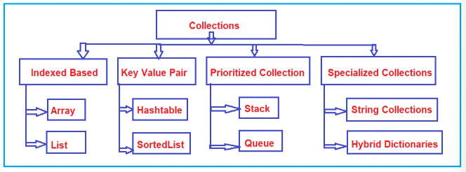
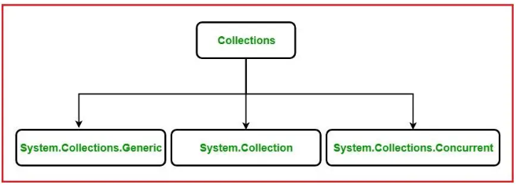

## Collection in C#

### Introduction to Collections

- Collection are groups of records.

### General Categories of Collections

### Types of Collections in C#

### Non-Generic Collections Classes in C#

- Defined under the **`System.Collection`**. Availabe on C# 1.0

|Methods|Description|
|-|-|
|**`ArrayList`**| <li>Implements **`System.Collection`**</li><li>Dynamically increased size</li>|
|**`Stack`**|<li>Represents LIFO non generic collection</li>|
|**`Queue`**|<li>Represents FIFO collection</li>|
|**`Hashtable`**|<li>Represents collection of key/value pair</li><li>Organize based on hash code of key</li>|
|**`SortedList`**|<li>Represents collection of key/value pair</li><li>Sorts by keys and are accissible by key & index</li>|

### Generic Collections Classes in C#

- Defined under the **`System.Collection.Generic`**. Available in C# 2.0

|Methods|Description|
|-|-|
|**`List<T>`**| <li>Represents strongly typed list of objects</li><li>Can be accessed by index</li><li>Provides methods to search, sort, manipulate lists</li>|
|**`Stack<T>`**|<li>Represents variable size LIFO collection of same type</li>|
|**`Queue<T>`**|<li>Represents FIFO collection</li>|
|**`HashSet<T>`**|<li>Represents set of values</li><li>Removes duplicate elements from collection</li>|
|**`Dictionary<TKey, TValue>`**|<li>Represents collection of key and value</li>|
|**`SortedList<TKey, TValue>`**|<li>Represents collection of key/value pair</li><li>Sorts by key based on the associated **`System.Collections.Generic.IComparer`** implementation</li>|
|**`SortedSet<T>`**|<li>Represents collection of objects that are maintained in sorted order</li>|
|**`SortedDictionary<TKey, TValue>`**|<li>Represents collection of key/value pairs that are sorted on the key</li>|
|**`LinkedList<T>`**|<li>Represents doubly linked list</li>|

### Concurrent Collection Classes in C#

- Available in .Net Framework V4
- Provides various threads-safe collection classes.
- **`System.Collections.Concurrent`** namespace provides classes for thread-safe operations

|Methods|Description|
|-|-|
|**`BlockingCollection<T>`**| <li>Provides locking and bounding capabilities for thread-safe collections</li><li>Implement **`System.Collections.Concurrent.IProducerConsumerCollection`**</li> |
|**`ConcurrentBag<T>`**|<li>Represents thread-safe, unordered collection of objects</li>|
|**`ConcurrentStack<T>`**|<li>Represents thread-safe last-in-first-out (LIFO) collection</li>|
|**`ConcurrentQueue<T>`**|<li>Represents thread-safe first-in-first-out (FIFO) collection</li>|
|**`ConcurrentDictionary<TKey, TValue>`**|<li>Represents thread-safe collection of key/value pairs</li><li>Can be accessed by multiple threads concurrently</li>|