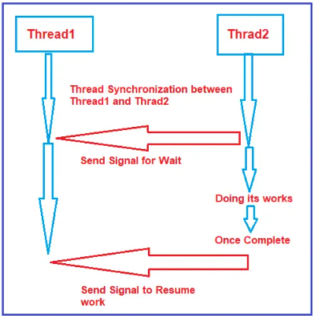

## MultiThreading

### Signaling Methodology

#### AutoResetEvent Class in C#

| Method | Return Type | Description | Parameters |
|--|--|--|--|
|**`AutoResetEvent(bool initialState)`**|Returns boolean value|Indicates whether to set the initial state to signaled|`true`: set initial state to signaled  `false`: set the initial state to non-signaled
|**`Set()`**|Return boolean value|Set state of event to signaled|`null`|
|**`Reset()`**|Return boolean value|Set state of event to non signaled, causing thread block|`null`|
|**`WaitOne()`**|Returns `true` if signal receives otherwise doesn't returns|Blocks the current thread until the current WaitHandle receives a signal|`null`|

#### Difference between `AutoResetEvent` and `ManualResetEvent`

- For each WaitOne method there should be corresponding `Set()` method in **`AutoResetEvent`**
- While **`ManualResetEvent`** release in only on `Set()` method.