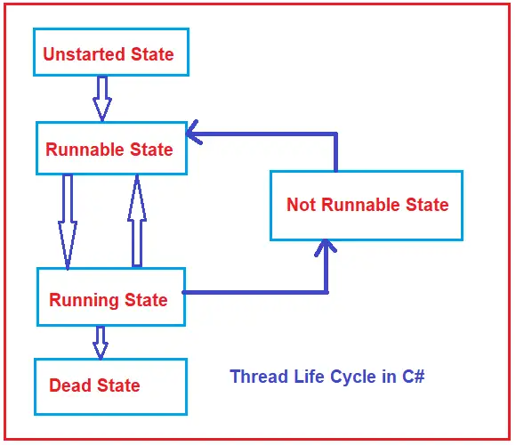

## MultiThreading

### Thread Cycle

#### Properties of Thread Class in C#

| Method | Return Type | Description |
|--|--|--|
|**`CurrentThread`**|Returns Thread Instance of currently running thread|Gets currently running thread instance|
|**`IsAlive`**|Return boolean value|Indicates execution status of current thread|
|**`Name`**|Return string value i.e name of thread|Used to set name of thread or `null`|
|**`ThreadState`**|Returns one of the `System.Threading.ThreadState` values indicate the state of the current thread|Get value containing the states of the current thread|

#### Methods of Thread Class in C#

| Method | Description |
|--|--|
|`Sleep()`|Suspends the current thread for the specific amount of time|
|`Join()`|Blocks the calling thread until the called thread completes it work|
|`Abort()`|Terminate the thread|
|`Suspend()`|Change the state of the current instance to the Running state|